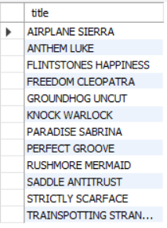
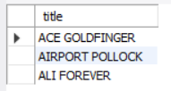
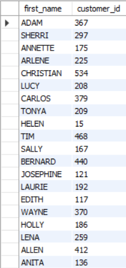
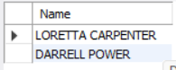

# Assignment - 1

### 1. Find out the PG-13 rated comedy movies. DO NOT use the film_list table

```sql
SELECT title
FROM film
WHERE rating="PG-13" and film_id in (
select film_id
from film_category
where category_id in (
select category_id
from category
where name="Comedy"));
```



### 2. Find out the top 3 rented horror movies.

```sql
SELECT title
FROM film
WHERE film_id IN (
SELECT film_id FROM film_category
WHERE category_id=11)
ORDER BY rental_rate DESC
LIMIT 0,3;
```



### 3. Find out the list of customers from India who have rented sports movies.

```sql
select first_name,customer_id
from customer
where address_id in (
select address_id
from address
where city_id in (
select city_id
from city
where country_id=44))
and
customer_id in (
select customer_id
from rental
where inventory_id in (
select inventory_id
from inventory
where film_id in (
select film_id
from film_category
where category_id = 15
)));
```



### 4. Find out the list of customers from Canada who have rented “NICK WAHLBERG” movies.

```sql
select distinct concat(customer.first_name," ",customer.last_name) as Name
from customer
join address on customer.address_id = address.address_id
join city on address.city_id = city.city_id
join country on country.country_id = city.country_id
join rental on customer.customer_id = rental.customer_id
join inventory on inventory.inventory_id = rental.inventory_id
join film_actor on film_actor.film_id = inventory.film_id
join actor on actor.actor_id = film_actor.actor_id
where country.country="Canada"
and actor.first_name = "NICK"
and actor.last_name = "WAHLBERG";
```



### 5. Find out the number of movies in which “SEAN WILLIAMS” acted.

```sql
select count(actor_id) as MoviesCnt
from film_actor
where actor_id in (
select actor_id
from actor
where actor.first_name = "SEAN"
and actor.last_name = "WILLIAMS")
```


