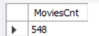
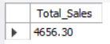
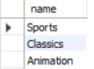

# Assignment 2

### 1. Find out the number of documentaries with deleted scenes

```sql
select count(film_id) as movies_cnt
from film
where special_features
like "%Deleted Scenes%"
and
film_id in (
select film_id
from film_category
where category_id in(
select category_id
from category
where name = "Documentary"
));
```

<p align="center">

</p>
<br><br>

### 2. Find out the number of sci-fi movies rented by the store managed by Jon Stephens

```sql
select count(*) as MoviesCnt
from rental
where staff_id in (
select staff_id
from staff where staff.first_name = "Jon" and staff.last_name="Stephens")
and
inventory_id in (
select inventory_id
from inventory
where inventory.film_id in (
select film_id
from film
where film_id in (
select film_id
from film_category
where category_id in (
select category_id
from category
where name = "Sci-Fi")
)));
```

<p align="center">

</p>
<br><br>

### 3. Find out the total sales from Animation movies

```sql
select sum(amount) as Total_Sales
from payment
join rental on payment.rental_id = rental.rental_id
join inventory on rental.inventory_id = inventory.inventory_id
join film_category on inventory.film_id = film_category.film_id
join category on film_category.category_id = category.category_id
where category.name = "Animation";
```

<p align="center">

</p>
<br><br>

### 4. Find out the top 3 rented category of movies by “PATRICIA JOHNSON”

```sql
select category.name
from rental
join inventory on rental.inventory_id = inventory.inventory_id
join film_category on inventory.film_id = film_category.film_id
join category on film_category.category_id = category.category_id
join customer on rental.customer_id = customer.customer_id
where customer.first_name = "PATRICIA"
and customer.last_name = "JOHNSON"
group by category.name
order by count( * ) desc
limit 3;
```

<p align="center">

</p>
<br><br>

### 5. Find out the number of R rated movies rented by “SUSAN WILSON”

```sql
select count( * ) as Rented
from rental
join inventory on rental.inventory_id = inventory.inventory_id
join film on inventory.film_id = film.film_id
join customer on rental.customer_id = customer.customer_id
where customer.first_name = "SUSAN"
and customer.last_name = "WILSON"
and film.rating = "R";
```

<p align="center">

</p>
